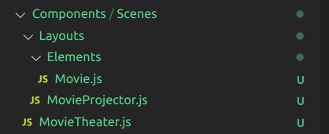

# React 360 _VR VIDEOS_

## Learning how to add Videos to 360 scene

  <hr>
  <br>
 
 ## WARNING!!

#### ⚠️ Video issues related to adblocker 🕵️

- SOMETIMES the video takes more than 10 secs to load, its due to how long the bundle takes to build

- After completing the tutorial, I spent more than an hour trying to figure out "why?" the video didn't show,
  at the end I decided to test it in another browser and bingo, I realized that it was related to my adblocker

[]()

- MOZILLA seems to work perfectly (without adblocker of course)

- CHROME dont work even without ( adblocker)

#### ⚠️ Video issues related to size 🕵️

- IF you add several videos without realizing that you have 100mb limit to upload to github, it s going to be messy

- I tried to delete the folder and then add only the video i was using and a couple of few low res img, but nothing worked

- I HAD TO CREATE A NEW APP AND A NEW REPO, then i could finally upload the tutorial

###### ORIGINAL APP

[too much data (apparently)](https://github.com/nadiamariduena/react-vr-intro2-video)

  <br>

  <br>
  <hr>
  <br>
  <br>
  <br>

# PREPARE THE MATERIALS 🍰

###### You can find 360 panorama videos here:

[360 videos (FREE)](https://artsandculture.google.com/project/360-videos)

[normal videos (FREE)](https://www.pexels.com/videos/)

<br>

# START ☁️

##### NEW IMAGE (change the default chess img)

- Click on the image to visit the artist shop (nice 3D models)

[](https://www.turbosquid.com/Search/Index.cfm?keyword=damaggio)

<br>

##### CREATE A COMPONENT FOLDER

- Inside the Component Folder, create a Scene Folder
- Inside the Scene Folder, create a Layout Folder
- Inside the Layout Folder, create a Elements Folder
  <br>

  [](three.jpg)

  <br>

- 👁️ Inside the Elements folder, create a file and call it:
- Movie.js

##### Add this

```javascript
import React from "react";
import { Video, View, asset } from "react-vr";

//Element
class Movie extends React.Component {
  render() {
    return (
      <View style={{ margin: 0.1, height: 2 }}>
        <Video style={{ height: 2 }} source={asset("video.mp4")} />
      </View>
    );
  }
}

module.exports = Movie;
```

<br>

#### INSIDE the Layout folder | create a file:

- call it "MovieProjector
- add the styles related to the video container

```javascript
import React from "react";
import { Video, View } from "react-vr";
import Movie from "./Elements/Movie.js";

//Layout
class MovieProjector extends React.Component {
  render() {
    return (
      <View
        style={{
          flex: 1,
          width: 5,
          flexDirection: "column",
          alignItems: "stretch",
          backgroundColor: "#333333",
          layoutOrigin: [0.5, 0.5],
          transform: [{ translate: [0, 0, -5] }],
        }}
      >
        <Movie />
      </View>
    );
  }
}

module.exports = MovieProjector;
```

<br>
<br>

#### INSIDE the Scenes folder | Create a file:

- call it "MovieTheater

```javascript
import React from "react";
import { View, Video } from "react-vr";
import MovieProjector from "./Layouts/MovieProjector.js";

//Scene
class MovieTheater extends React.Component {
  render() {
    return <MovieProjector />;
  }
}

module.exports = MovieTheater;
```
